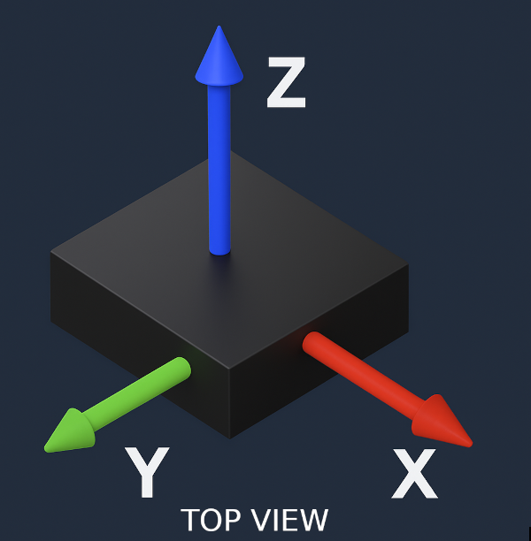
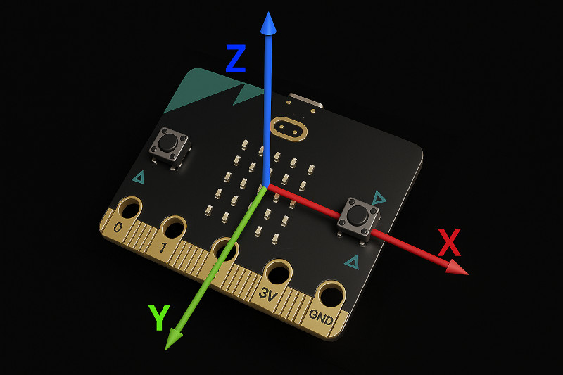

# How Does an Accelerometer Work?

An accelerometer is a tiny sensor that can measure acceleration - the rate at which something speeds up, slows down, or changes direction. But how does it actually do that?

## Think of It Like a Magic Marble
Imagine a tiny marble inside a box. When you tilt or shake the box, the marble rolls around. If the marble pushes against the left side, it means the box is moving right. If it presses the bottom, the box is moving upward.

An accelerometer works in a similar way. Inside the chip, there are tiny parts (called MEMS - Micro-Electro-Mechanical Systems) that move slightly when the device is shaken, tilted, or moved. These movements are so small that we can't see them, but special circuits detect how much and in which direction they moved.

## Three Axes: X, Y, and Z
The accelerometer measures movement in three directions: the X-axis detects motion left and right, the Y-axis measures movement forward and backward, and the Z-axis captures movement up and down.

By looking at how much acceleration is happening on each axis, we can figure out if the device is standing still, moving, tilted, or even falling.

## Accelerometer Axis on microbit

- The X-axis runs horizontally across the board from button A to button B. It becomes positive when the board is moved or tilted to the right. 

- The Y-axis runs vertically from the USB connector to the gold edge connector (the golden lines marked with pin numbers like 0, 1, 3V, and GND). It becomes positive when the board is tilted downward toward the USB connector.

- The Z-axis is perpendicular to the board. It is positive when the board is positioned face down (with the LED matrix facing the table) and negative when the board is lying flat with the LED matrix facing up.

At rest on a flat surface, the micro:bit typically shows approximately +1g on the Z-axis due to gravity, while X and Y remain close to 0g.

## Reference

- If you want in-depth understanding of how does accelerometer works, refer this [video](https://www.youtube.com/watch?v=KuekQ-m9xpw).
- [How Accelerometers Work - The Learning Circuit](https://www.youtube.com/watch?v=9WAckt2vrrQ): This is also another useful video that gives intro acceleration and accelerometer
