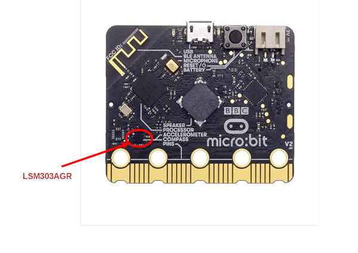

# Motion Sensing with the Accelerometer

In this chapter, we will explore the onboard accelerometer of the micro:bit v2. This small sensor can detect motion, orientation, and even gestures like shaking or tilting the board. We can use it for fun projects like step counters(measure movement of your steps), gesture‑controlled games, or fall detection.

## Real-World Examples of Accelerometers

You've likely used accelerometers without realizing it. For example, smartphones contain small MEMS accelerometers that detect orientation changes (like switching from portrait to landscape), count steps, and enable tilt-based controls. Game controllers use accelerometers, often along with gyroscopes, to sense tilt and motion. Rockets and navigation systems use accelerometers to measure changes in speed and direction. In cars, accelerometer-based sensors detect sudden deceleration and trigger airbag deployment within milliseconds during a collision. 

## The LSM303AGR Sensor on micro:bit v2

micro:bit v2 uses the chip called "LSM303AGR". That chip includes both a 3‑axis accelerometer and a 3‑axis magnetometer. We will focus on the accelerometer for now. Later, we will use the magnetometer in a separate chapter. The nRF52833 chip (the main processor of the micro:bit) talks to these sensors over a simple protocol called I²C (commonly written as I2C).

The sensor measures acceleration along three axes: X, Y, and Z. That lets us know how the board is moving or rotating in space.

You can find more technical details and the [datasheet](https://www.st.com/resource/en/datasheet/lsm303agr.pdf) for the LSM303AGR chip in the official documentation [here](https://www.st.com/en/mems-and-sensors/lsm303agr.html).

