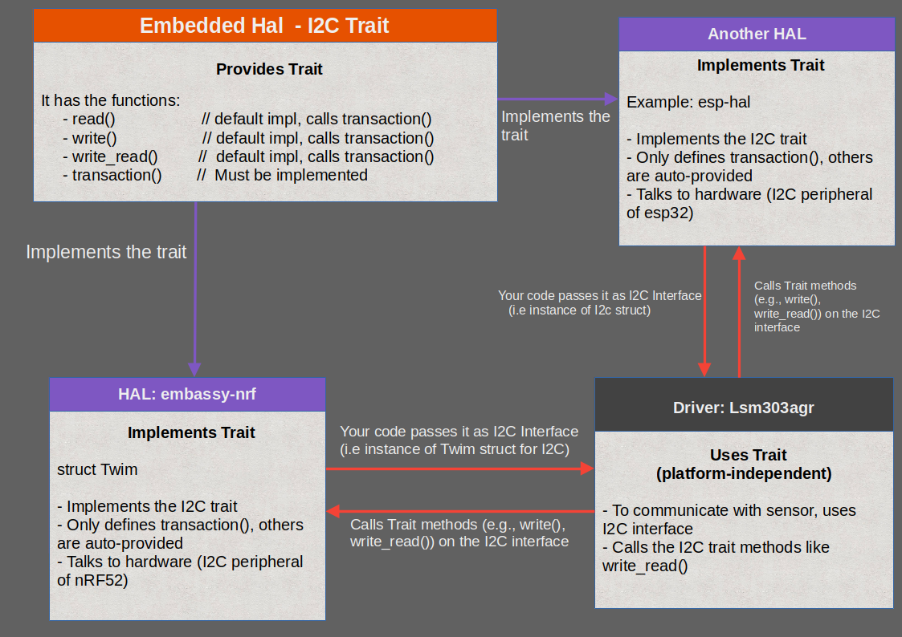

# Embedded HAL Trait: Gluing embassy-nrf HAL with lsm303agr Driver

This is an optional section to understand how the embedded-hal trait helps to glue the HAL with the driver. We will just take a quick look at how Twim and Lsm303agr are connected through this trait system. You can skip this for now and come back to it later if you're interested.

Drivers like lsm303agr are made to work on many different boards, not just the micro:bit. They do this by using the embedded-hal traits, which define common interfaces like I2C. These traits don't depend on any specific microcontroller. The actual hardware support comes from HALs like embassy-nrf, which provide the real implementation for chips such as the nRF52833 used in the micro:bit v2.

In this section, we will see how these components fit together. Specifically, how the Twim instance from embassy-nrf can be passed to the lsm303agr driver, allowing it to talk to the LSM303AGR sensor using the embedded-hal traits.

The I2C trait defines functions:

- **transaction:** Performs a sequence of reads and writes as a single I2C transaction. This is the core method that must be implemented by the HAL. The other functions (read, write, write_read) are built on top of this.
- read: Reads bytes from the I2C slave. This has a default implementation that internally calls transaction.
- write: Writes bytes to the slave. This also has a default implementation that uses transaction.
- write_read: Writes a few bytes, then reads from the slave without releasing the bus. This too is implemented using transaction.

You can see the trait definition [here](https://github.com/rust-embedded/embedded-hal/blob/520945278942c301433c391f63a075227d9e7c84/embedded-hal-async/src/i2c.rs#L25C11-L25C14)

## I2c Trait and HAL Integration

<a href="../images/embedded-hal-trait-glue.png"></a>

This is an example diagram illustrating one of the traits provided by embedded-hal, the I2c trait. As we learned, this trait defines four functions, and the transaction function must be implemented by the HAL.

The lsm303agr driver works with any I2C interface that implements the I2c trait. As shown in the diagram, multiple HALs can implement this trait. For example, the embassy-nrf HAL provides an implementation of I2c for the Twim struct, which can be used with lsm303agr.

Similarly, another HAL like esp-hal (for ESP32) also implements the I2c trait. This means we can use the same lsm303agr driver on different platforms just by passing in a compatible I2C implementation. This trait-based design makes the driver platform-independent and reusable across different boards like the ESP32 and nRF-based micro:bit.

## Driver (lsm303agr) side 
Now let's look at what happens on the driver side with an example. When you call "sensor.acceleration()", it eventually results in calling the "write_read" function of the I2c trait provided by the embedded-hal-async(since we are using the async version). Similarly, when you call sensor.init(), it results in calling the "write".

Here's a simplified version of the function used inside the lsm303agr crate to read the accelerometer:

```rust
// sensor.acceleration() calls => read_accel_3_double_registers() calls => i2c.write_read()
async fn read_3_double_registers<R: RegRead<(u16, u16, u16)>>(
        &mut self,
        address: u8,
    ) -> Result<R::Output, Error<E>> {
        let mut data = [0; 6];

    // Here, the driver uses the I2C interface we provided and calls its "write_read" function
    self.i2c
        .write_read(address, &[R::ADDR | 0x80], &mut data)
        .await
        .map_err(Error::Comm)?;

    Ok(R::from_data((
        u16::from_le_bytes([data[0], data[1]]),
        u16::from_le_bytes([data[2], data[3]]),
        u16::from_le_bytes([data[4], data[5]]),
    )))
}
```

This function is defined in the lsm303agr crate and uses "write_read" on the provided I2C interface. In our case, that I2C interface is an instance of Twim struct from embassy-nrf.

## HAL (embassy-nrf) side

Here is how the Twim struct implements the I2c trait (you can also find this in the [Github repository](https://github.com/embassy-rs/embassy/blob/b528ed06e3025e0803e8fd6dc53ac968df9f49bc/embassy-nrf/src/twim.rs#L817)):

```rust
// Trait implementation
impl<'d, T: Instance> embedded_hal_async::i2c::I2c for Twim<'d, T> {
    async fn transaction(&mut self, address: u8, operations: &mut [Operation<'_>]) -> Result<(), Self::Error> {
        self.transaction(address, operations).await 
    }
}

// ...
// ...
impl<'d, T: Instance> Twim<'d, T> {
    ...
    pub async fn transaction(&mut self, address: u8, mut operations: &mut [Operation<'_>]) -> Result<(), Error> {
        // The full logic of the function, which is not important for us at the moment.
        Ok(())
    }
// ...
}
```

Now, you might wonder: if the Twim type implements the embedded_hal_async::i2c::I2c trait, where are the rest of the required functions like write_read, read, or write defined?

The answer is: they are not defined manually in the Twim implementation. And they don't have to be.

That's because the embedded-hal-async crate provides default implementations of these methods (read, write, and write_read) using just the transaction function.

This means that once Twim implements the transaction method, all the other required methods automatically become available through the trait's default implementation.

For example, here is the default implementation of the write function:
```rust
 #[inline]
    async fn write(&mut self, address: A, write: &[u8]) -> Result<(), Self::Error> {
        self.transaction(address, &mut [Operation::Write(write)]) // => Calls the transaction
            .await
    }
```

This design pattern is what makes embedded Rust so powerful and modular. HAL crates only need to implement minimal logic, and driver crates stay reusable across different platforms.
