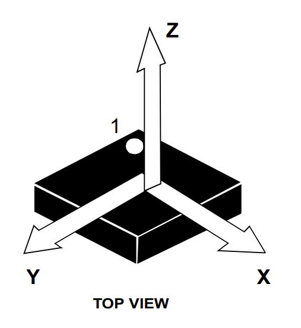

# Gravity

From our observation, if we keep the Micro:bit resting on a table with the chip side (opposite to the LED matrix) facing up, it gives a Z value around +1000. But wait, the definition of acceleration is the rate of change of velocity with respect to time. So if the Micro:bit isn't moving, why are we getting a non-zero value?

Because, Gravity!  

1 g (1000 mg), which represents the standard acceleration due to gravity on Earth, is approximately 9.8 m/s². And that's exactly what the accelerometer is reacting to.

## Why positive when chip side is facing up?

If you're wondering what it really means when the Z value is positive with the chip side facing up and negative when the LED matrix side is up ; you're on the same boat as me. It puzzled me too. I ignored it at first, but it kept bothering me. So I finally dug into it again and came across a [great article from Movella](https://base.movella.com/s/article/Why-does-an-accelerometer-measure-gravity-with-positive-sign?language=en_US) that cleared up the confusion.

  
  
Simplified, single-axis MEMS accelerometer - image derived from: <a href="https://base.movella.com/s/article/Why-does-an-accelerometer-measure-gravity-with-positive-sign?language=en_US" target="_blank">Movella</a>

As we know, the sensor chip is mounted on the back side of the Micro:bit (opposite the LED matrix). Imagine the accelerometer positioned like in the image above, with the chip side facing up. The black box marked `m` is the mass (technically called the "proof mass"). The part that looks like a spring is indeed a spring, not to be confused as a resistor.

### How the Sensor Reacts to Gravity and Movement

The fundamental principle behind a MEMS accelerometer is that a tiny mass is suspended inside the chip by springs. When acceleration happens, the mass wants to stay where it is (thanks to inertia), and the springs either compress or stretch depending on the direction of the acceleration.

Now, gravity is always pulling down; towards the Earth's center. So when the Micro:bit is resting on the table with the chip side facing up, gravity pulls the internal mass downward. This compresses the spring, and like any spring you've played with, it wants to push back to its original shape. That push-back force is upward ; in the positive Z direction. And that's what the sensor measures as +1 g.

 
  
Image source: lsm303agr Datasheet

If the accelerometer is accelerated upward (along the positive Z-axis), the internal mass tends to stay in place due to inertia. This also causes the spring to compress, creating upward force. The sensor interprets this increased force as a positive acceleration along the Z axis.

Likewise, if the accelerometer is accelerated downwards (along the negative Z-axis), then the internal proof mass will pull upwards, elongating the spring-damper system. The accelerometer will sense this as a negative acceleration. 

If you flip the Micro:bit so the LED matrix is facing up, the Z axis now points downward. Gravity still pulls the mass down, but since the Z axis has flipped, that pull is now in the negative Z direction. This causes the spring to stretch, because the mass is still resisting the pull. The spring pulls downward (in the -Z direction), and that's why the sensor reads around -1000.

