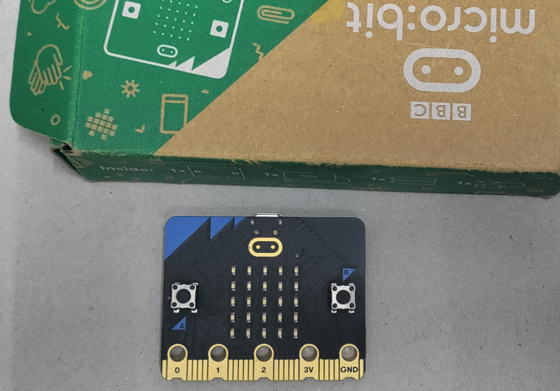

# Observations

Let's see the accelerometer values with the micro:bit in different positions.

## X Positive Close to 1g

When you place the micro:bit so that the golden logo is on the right side (as shown in the picture), the X-axis reading will be close to +1000 mg.  The Y and Z values will be close to zero.

## X Negative Close to 1g

When you place the micro:bit so that the golden logo is on the left side (as shown in the picture), the X-axis reading will be close to -1000 mg. The Y and Z values will be close to zero.

---

## Y Positive Close to 1g

When you position the micro:bit so that the USB connector points downward (as shown in the picture), the Y-axis reading will be close to +1000 mg.  The X and Z values will be close to zero.

## Y Negative Close to 1g

When you position the micro:bit so that the edge connector points downward (as shown in the picture), the Y-axis reading will be close to -1000 mg.  The X and Z values will be close to zero.

---

## Z Positive Close to 1g

When you place the micro:bit face down (LED matrix facing down), the Z-axis reading will be close to +1000 mg.
The X and Y values will be close to zero.

## Z Negative Close to 1g

When you place the micro:bit face up (LED matrix facing up), the Z-axis reading will be close to -1000 mg.
The X and Y values will be close to zero.

## Other Position
Hold the micro:bit in your hand and slowly tilt it in different directions. Observe how the X, Y, and Z values change as you rotate the board. 
