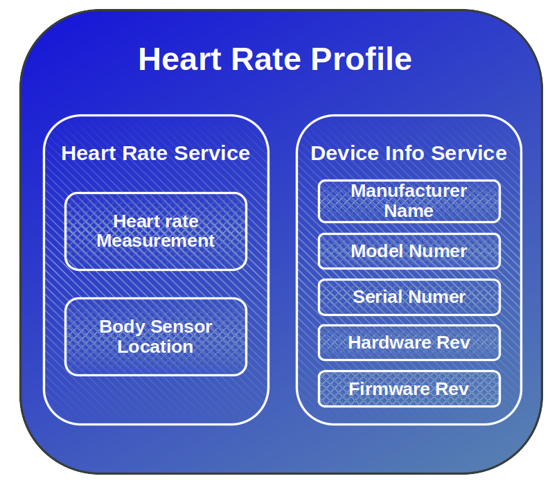
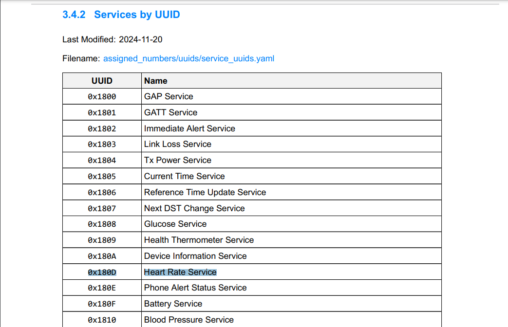
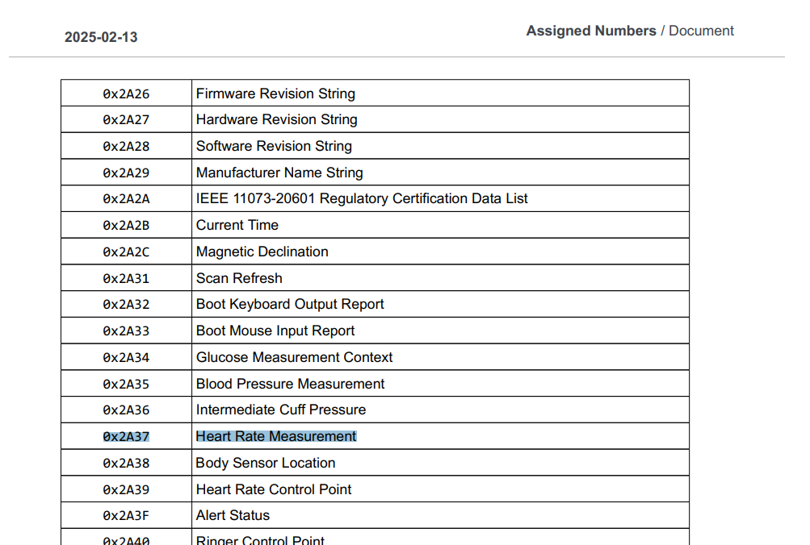

# Attribute Protocol (ATT) and  Generic Attribute Profile (GATT)

In the previous chapter, we learned that the GAP layer helps Bluetooth LE devices find each other through advertising. After they connect, they need a way to send and receive data. This is where the ATT and GATT layers come in; they define how data is structured and transmitted between devices.

## Client-Server Model

There are two roles in GATT: Server and Client.  The server holds data as attributes, and the client accesses this data. Typically, a peripheral device (like a sensor) acts as the server, and a central device (such as a smartphone) functions as the client.

    <i class="fa fa-info"></i>
    

        <b class="alert-title">Central-Peripheral vs Server-Client</b>
            
The client and server roles in GATT are independent of the peripheral and central roles in the GAP. This means a central device can be either a client or a server, and the same applies to a peripheral device.

    

For example, in a smartphone and fitness tracker scenario, the fitness tracker (peripheral) typically acts as a GATT server, storing sensor data like heart rate or step count, while the smartphone (central) acts as a GATT client, reading this data to display it in an app.  

However, if the smartphone needs to send configuration settings to the tracker (e.g., adjusting display brightness or setting an alarm), it temporarily becomes the server, and the fitness tracker acts as the client to receive these settings.

## Attribute Protocol (ATT) - The Foundation

ATT defines how data is stored as attributes; attributes are the base foundation and building blocks. Each attribute has a unique handle, type(a 16-bit identifier or 128-bit UUID), permissions (e.g., readable, writable), and data(the actual value). The client can read, write, or subscribe to data.

## Generic Attribute Profile (GATT) - Organizing the Data
GATT builds on ATT by adding structure and meaning to the data. It defines how data is grouped and accessed.  

GATT organizes attributes into:  

- Characteristic: a single piece of data that a device can share. Other devices can read, write, or receive updates from it. For example, a Heart Rate Measurement characteristic holds the current heart rate and can send updates when it changes.

- Service: a collection of related characteristics grouped together. For example, the Heart Rate Service includes characteristics for heart rate measurement and the sensor's location on the body.

- Profiles: A collection of related services (e.g., Heart Rate Service, Device Information Service).  

The following picture illustrates the profile, services and characteristics for the Heart Rate Sensor

### Characteristic Descriptors

Descriptors are optional attributes that provide extra information or control over how a characteristic behaves.

The most commonly used descriptor is the Client Characteristic Configuration Descriptor (CCCD). It allows a client (like a smartphone) to enable or disable notifications or indications from the server (like a heart rate sensor).

For example, in the Heart Rate Service, the client can write to the CCCD to subscribe to updates. This way, the heart rate sensor can push new data to the phone without the phone having to keep asking.

### UUID
Let's revisit the UUID part in the attribute. Each service and characteristic should have a unique ID value. The UUID could be either a standard Bluetooth-SIG defined UUID (16-bit) or a custom UUID (128-bit).

You can get the predefined UUID list from here: [https://www.bluetooth.com/specifications/assigned-numbers/](https://www.bluetooth.com/specifications/assigned-numbers/)

Pre-defined UUID for Heart Rate Service:

Pre-defined UUID for Heart Rate Monitor characteristic:

**Custom UUID**:

Custom UUIDs are used when you're implementing a service that isn't part of the standard, predefined Bluetooth services. However, if you're implementing a common service like a heart rate monitor or battery level, it's best to use the official UUIDs provided in the Bluetooth specifications.

To generate a custom UUID, you can visit the [UUID Generator](https://www.uuidgenerator.net/) and create unique UUIDs for your services and characteristics.
