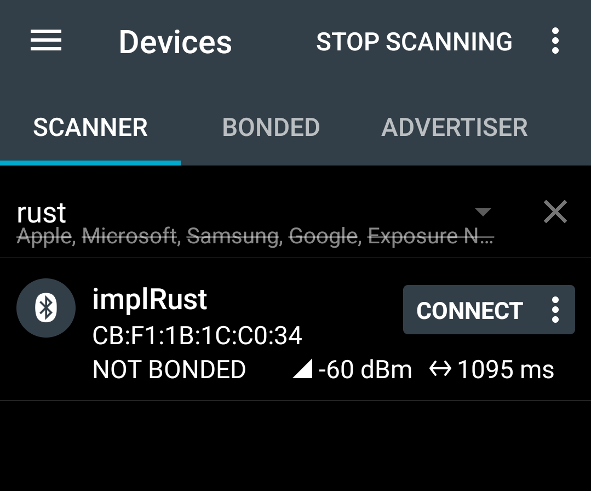
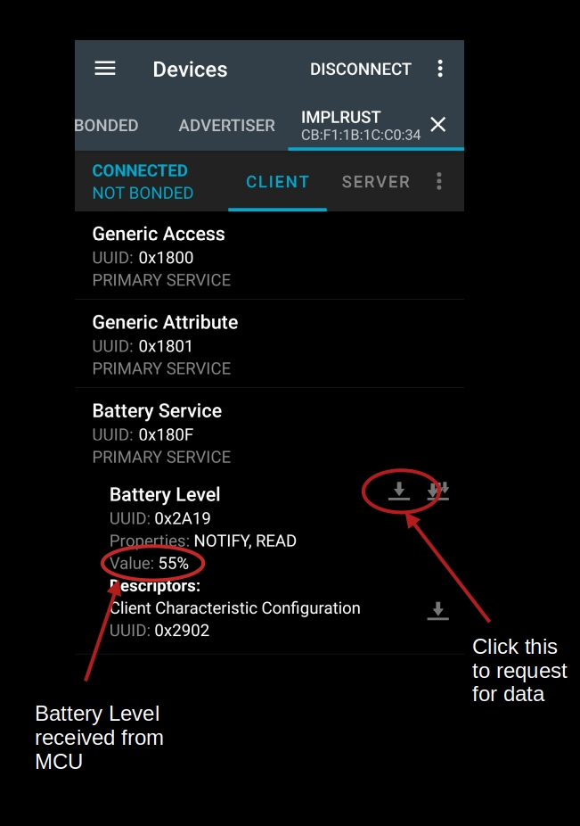
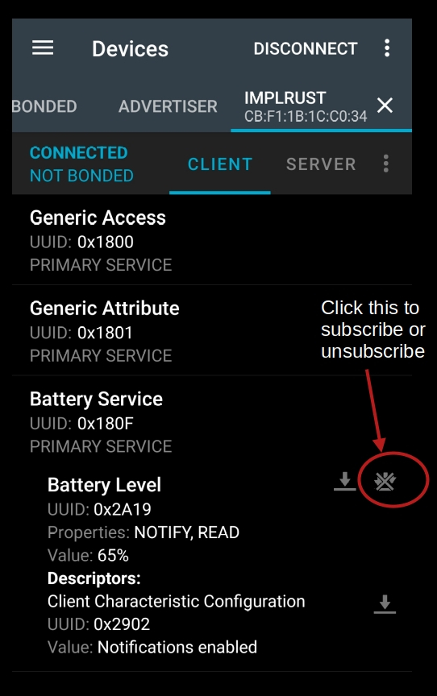

# Connect Your Rust-Powered microbit to a Phone Using nRF Connect

The coding part is done. Now let's run the program and connect to the micro:bit using the [nRF Connect mobile app](https://www.nordicsemi.com/Products/Development-tools/nRF-Connect-for-mobile).  There is also a desktop version of the app available if you prefer to use your computer instead.

## Clone the existing project

If you run into any issues, feel free to clone (or refer to) the project I've created and navigate to the "hello-ble" folder.

```sh
git clone https://github.com/ImplFerris/microbit-projects
cd microbit-projects/hal-embassy/hello-ble
```

## Flash

You can flash the program into the micro:bit.

```sh
cargo run
```

You should see output like this:

```sh
softdevice RAM: 13328 bytes 
```
If you encounter a panic about insufficient RAM, or a warning that you've allocated more RAM than needed, follow the steps in [this guide](./softdevice.md) to adjust the SoftDevice RAM settings.

## How to connect?

Once you flash the code, open the nRF Connect mobile app. Scan for the Bluetooth name we set (mine is "implRust") and connect to it. 

<a href ="./images/nrf-connect.jpg"></a>

If successful, you should get the following gets printed in the system console
```sh
advertising done! I have a connection.
```

The app will show the supported service and characteristics. 

### Reading the value

To read the current battery level, tap the icon highlighted in the image below:
 
<a href ="./images/microbit-ble-read_battery_level-rust.jpg"></a>


### Subscribing to Notifications

To receive automatic updates when the battery level changes, tap the icon with three downward arrows under the characteristic (as shown in the image). This subscribes your phone to notifications from the micro:bit.

<a href ="./images/microbit-ble-nrf-subscribe-rust-code.jpg"></a>


