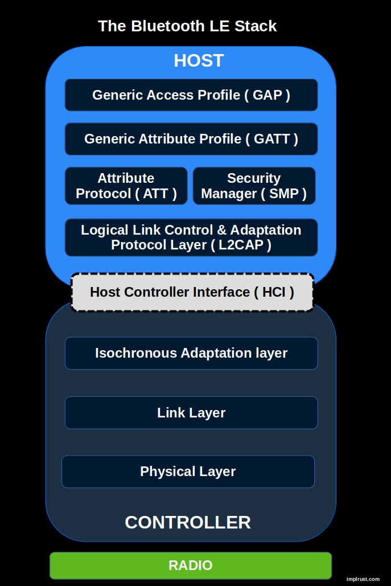

# TrouBLE - Bluetooth Low Energy (BLE) Host implementation for embedded devices written in Rust

In the previous chapter, we used the nrf-softdevice crate to send data (battery level) from the micro:bit to a phone. Now, we will introduce you to TrouBLE, a cross-platform BLE Host stack written in Rust. TrouBLE is still in earlier stage (the first version was released in March 2025 on crates.io)

> TrouBLE is a Bluetooth Low Energy (BLE) Host implementation for embedded devices written in Rust, with a future goal of qualification.

## BLE Host

In the BLE stack, the system is split into two parts:

- Controller : Handles the low-level radio operations.
- Host : Manages the higher-level protocols like GATT, L2CAP, ATT, and SMP.

These two components communicate via the Host Controller Interface (HCI); a standardized protocol that can run over various transports such as UART, USB, or even in-memory shared buffers.

## Controller-Agnostic

This separation allows the same Host stack to work across different controllers. TrouBLE works with any controller that implements the required traits from bt-hci crate (bt-hci is like embedded-hal but for bluetooth communications). That means you can write one BLE application in Rust and reuse it across platforms like:

- Nordic nRF52 (via SoftDevice Controller)
- ESP32
- Raspberry Pi Pico W
- Apache NimBLE
- UART HCI

More platforms may be supported in the future. You can refer to the [TrouBLE GitHub repository](https://github.com/embassy-rs/trouble) for the latest list of supported controllers.

## For microbit(more precisely, for nRF52) - Softdevice vs Softdevice Controller

In the previous chapter, we used the nrf-softdevice crate. This approach requires you to flash the SoftDevice firmware onto the device and configure the memory layout (via memory.x). The nrf-softdevice crate acts as a Rust wrapper around Nordic's original SoftDevice. The Softdevice is a complete, closed-source, precompiled Bluetooth stack. The SoftDevice includes both the Controller (Link Layer) and Host (GAP, GATT, L2CAP, etc.) layers, providing a full BLE implementation.

In contrast, the SoftDevice Controller is a newer solution designed for the nRF52 and nRF53 series. Unlike the original SoftDevice, this is only the Controller part. It's not a Rust library by itself; the nrf-sdc crate provides Rust bindings to it; This crate implements the bt-hci traits. However, since it only handles the controller side, you still need a Host stack to complete the BLE functionality - and that's where Trouble (pun intended) comes in. TrouBLE is the Host stack that can pair with the SoftDevice Controller.

- Old approach: Uses the full SoftDevice (controller + host) with the nrf-softdevice crate. Fully certified.
- New approach: Uses the SoftDevice Controller with the nrf-sdc crate and the Rust-based Trouble host stack. More flexible, but would need certification for commercial use.
