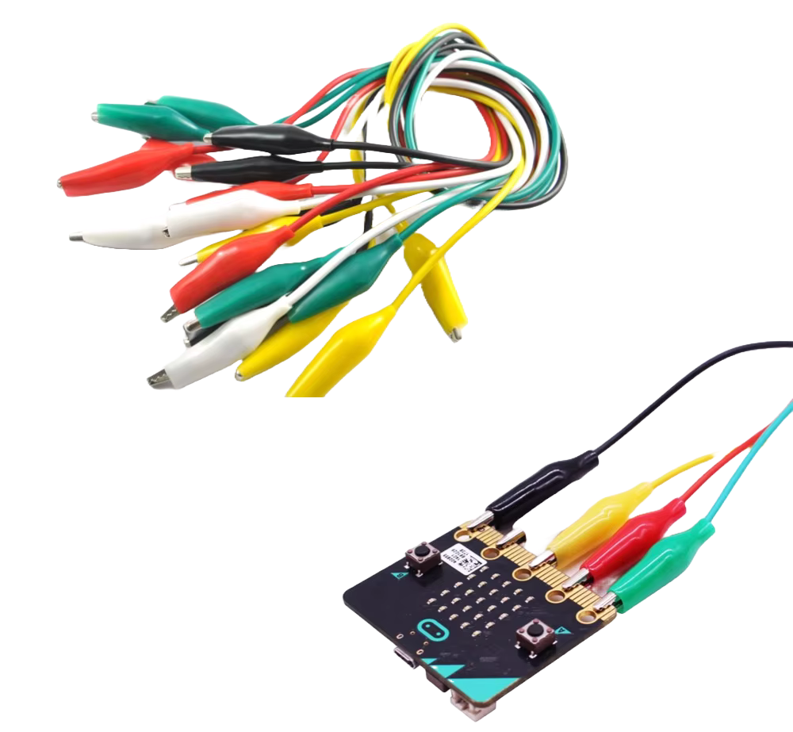
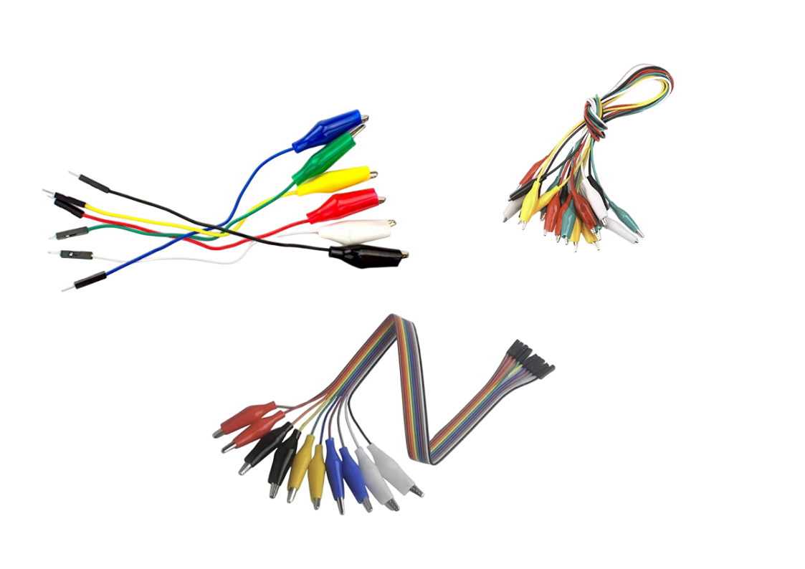
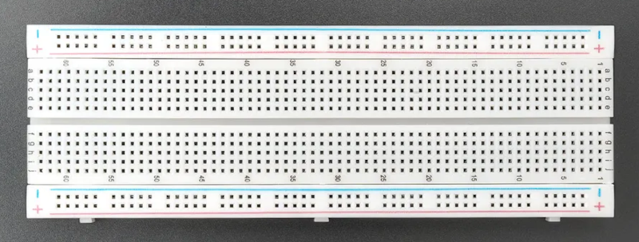

# External Components

So far, we have worked with the built-in features of the micro:bit v2. From now on, we will be using external components such as sensors, displays, and input devices. To follow along, you may need to purchase extra parts like modules, jumper wires, and a breadboard.

## Alligator clip wires

Alligator clip wires (also called crocodile clips) are a simple way to connect external components to the micro:bit's edge connector, especially the large pins labeled P0, P1, and P2.

These clips come in different styles:

- Double-ended: Alligator clips on both sides.

- Hybrid: One end is an alligator clip, and the other end is a male or female header for plugging into breadboards or modules.

## Breadboard

You can manage most of the exercises without a breadboard. However, having one can be helpful in some cases. A breadboard allows you to build circuits without soldering. It makes it easier to connect multiple components, organize your wiring, and experiment with different setups.

## Expansion board

The microbit's edge connector exposes many of its GPIO pins, power lines, and communication interfaces (such as I2C, SPI, and UART). While a few pins (like P0, P1, and P2) are accessible as large pads, the rest are too small and closely spaced to connect directly.

In some projects, you might need an expansion board(breakout board). This plugs into the edge connector and gives you access to all the pins through standard headers, making it much easier to connect components using jumper wires and a breadboard.

You can see the list of expansion board on the microbit official website [here](https://microbit.org/buy/accessories/).  You can also search in your local e-commerce website or shop to find cheaper alternative. Also make sure it is for microbit "v2"

Don't buy unless you need it. We wont be using this in our exercises. 

