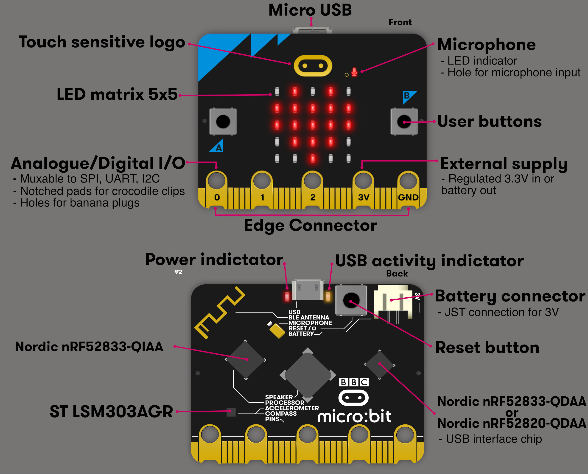

# Hardware details of Micro:bit

Everything I am going to explain here is already covered in detail in the official Microbit documentation.  I will give brief on the hardware details.  For more in depth technical details, you will need to read the [official documentation here](https://tech.microbit.org/hardware/2-0-revision/).

At the heart of the board is the nRF52833 system-on-chip (SoC). This is where all our code will run. It's built around a 32-bit Arm Cortex-M4 processor with a floating point unit(FPU). It comes with 128KB of RAM (yep, just 128KB!) and runs at 64 MHz speed.

- **Buttons A and B**: These are two user buttons you can use as input. For example, if you're making a simple game, you can use them to move a player or trigger actions.
- **5x5 LED Matrix**: This grid of red LEDs can display text, symbols, or animations.
- **Edge Connector Pins**: Pins labeled 0, 1, 2, 3V, and GND let you connect external components like sensors, LEDs, or motors.
- **Microphone**: Used to detect sound levels or respond to audio input (This was the fun part when i first purchased the board)
- **Speaker**: You can play sounds and tones directly from the board.
- **USB Connector**: Used to connect the board to your computer for programming or power.
- **Battery Connector**: You can power the board using batteries when not plugged into USB (If you purchased with accessories, you will get the batter and the cable for this)
- **BLE Antenna**: Enables Bluetooth communication, so you can connect the board wirelessly to other devices.

Don't be bothered by other details at the moment. 

## Datasheets and Manuals

Datasheets and technical manuals are helpful for understanding the pin layout, electrical specifications, communication methods, and other details of hardware components.

- **Overview:** This webpage "[https://tech.microbit.org/hardware/2-0-revision/](https://tech.microbit.org/hardware/2-0-revision/)" provides an overview of each component in the microbit 

- **nRF52833:** As i mentioned earlier, the microbit utilizes the nRF52833 System-on-Chip (SoC). To understand how to configure its pins and manage input/output operations, it's essential to read the official product specification. You can access the document [here](https://docs.nordicsemi.com/bundle/ps_nrf52833/page/keyfeatures_html5.html).

- **LSM303AGR:** A low-power 3-axis accelerometer and magnetometer sensor used for motion detection and orientation tracking. You can access its datasheet [here](https://www.st.com/en/mems-and-sensors/lsm303agr.html)

- **Schematic:** This provides a detailed diagram showing the electrical connections and components of the device. The full schematic in PDF format is available on GitHub [here](https://github.com/microbit-foundation/microbit-v2-hardware/blob/main/V2.00/MicroBit_V2.0.0_S_schematic.PDF). Detailed schematic information is also available on this webpage: [https://tech.microbit.org/hardware/schematic/](https://tech.microbit.org/hardware/schematic/)

Don't be overwhelmed by all the information here or in the document. We will take it step by step, starting with some fun exercises. You can always return later to explore the details at your own pace.
