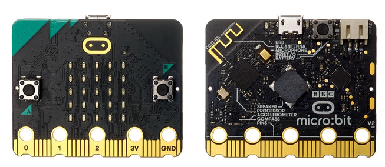

# Intro - Embedded Rust Programming with Microbit

In this book, we use the Microbit (v2) with Rust to build simple and fun projects. The board is officially called "micro:bit". I will refer to it as both microbit and micro:bit interchangeably. The Microbit is widely used for learning purposes and comes with several built-in components, including an LED matrix, microphone, buttons, speaker, Bluetooth, and more.

## Prerequisites

- **Rust basics:** You should have a basic understanding of Rust. This book doesn't cover the fundamentals of the language.  If you're new to Rust, I recommend starting with the [official Rust book](https://doc.rust-lang.org/book/). You can also find other resources [here](https://implrust.com/learn/beginner/).

## Meet the Hardware

You can search for "Micro Bit V2" on e-commerce websites and choose the option that suits your needs. You may buy just the board, or a package that includes accessories like a battery and micro USB cable. Some sellers also offer kits with additional sensors. It is up to you to decide which version fits your project best.  You can refer the official [microbit website](https://microbit.org/buy/) also to find the seller.

**Note:** I purchased the Micro Bit V2.21 with the accessories(micro USB cable). You might receive a different V2 version, which is fine as long as it is a V2 variant (not the older V1). I also bought other sensors as I went along.

## Why this book?

There's already a nice book called "Discovery" that covers embedded Rust with the micro:bit. So you might be thinking - why write another book? Well, why not? :) Honestly, one of the best ways I learn and really dig into something is by teaching it to others. When I explain stuff to others, it helps me understand it better too. So this book is me learning out loud and bringing you along for the ride.

Like the other "impl Rust" books for the [ESP32](https://esp32.implrust.com/) and [Raspberry Pi Pico](https://pico.implrust.com/), this one is meant to be fun and hands-on too. Hopefully someone out there finds it useful - that's the goal behind writing it.

## Other Learning Resources

- **[The Embedded Rust Book](https://docs.rust-embedded.org/book/intro/index.html) :** This is a great resource if you're just getting into embedded Rust. You don't have to read it before jumping into this book, but it's a good place to start.   I'll do my best to explain things as we go, but if I miss something or don't cover it clearly, this book can really come in handy. One way or another, I definitely recommend giving it a read.

-  **[Discovery](https://docs.rust-embedded.org/discovery-mb2/index.html):** This is the book I mentioned earlier. It covers embedded Rust programming with the micro:bit. You can read it in any order - either start with "impl Rust for Microbit" and then read "Discovery," or the other way around.

## License

The "impl Rust for Microbit" book(this project) is distributed under the following licenses:

* The code samples and free-standing Cargo projects contained within this book are licensed under the terms of both the [MIT License] and the [Apache License v2.0].
* The written prose contained within this book is licensed under the terms of the Creative Commons [CC-BY-SA v4.0] license.
 
[MIT License]: https://opensource.org/licenses/MIT
[Apache License v2.0]: http://www.apache.org/licenses/LICENSE-2.0
[CC-BY-SA v4.0]: https://creativecommons.org/licenses/by-sa/4.0/legalcode

## Support this project

You can support this book by starring this project on [GitHub](https://github.com/ImplFerris/microbit-book) or sharing this book with others 😊

### Disclaimer: 
The experiments and projects shared in this book have worked for me, but results may vary. I'm not responsible for any issues or damage that may occur while you're experimenting. Please proceed with caution and take necessary safety precautions.

