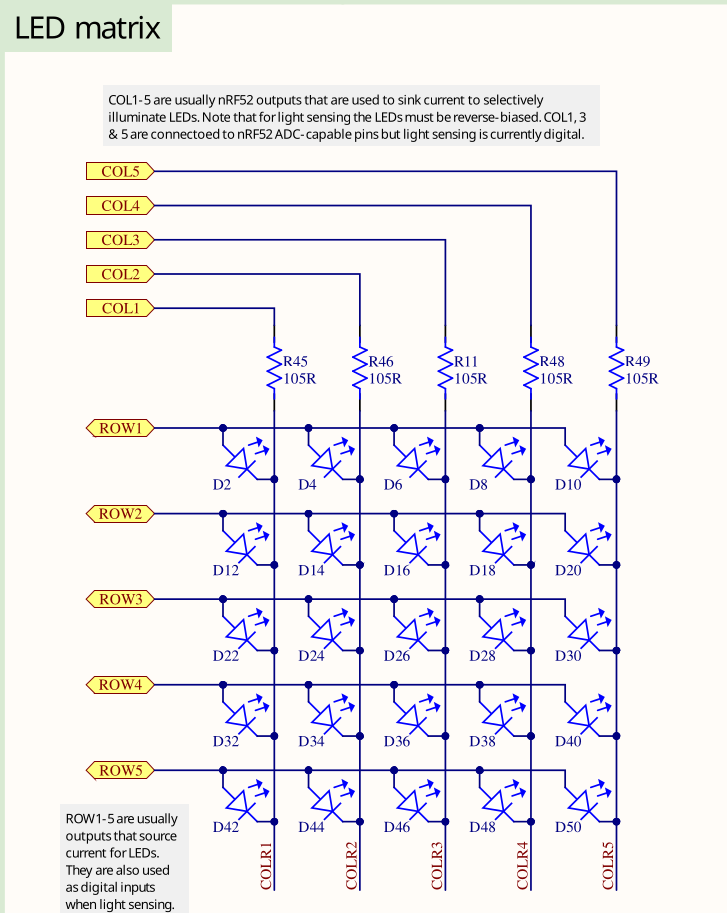
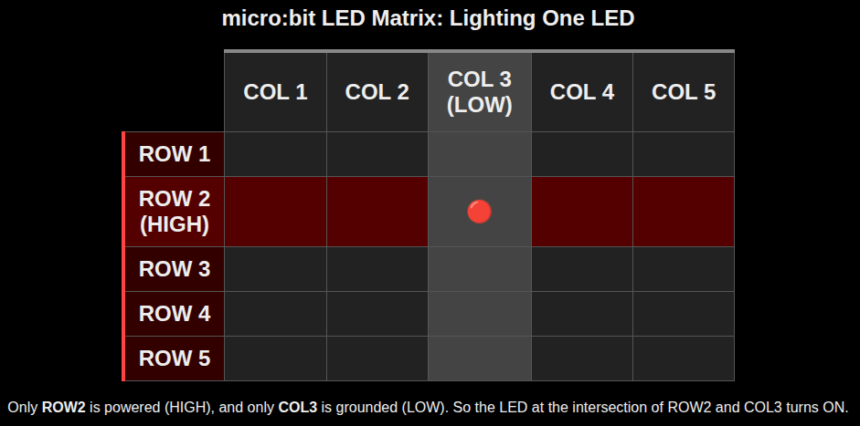

# LED Matrix

On the micro:bit board, the onboard LEDs are arranged in a 5x5 matrix, giving a total of 25 LEDs. Unlike other boards that have just one or two LEDs each connected to dedicated GPIO (General Purpose I/O) pins, the micro:bit can't use a separate GPIO pin for every LED. If it did, all the GPIO pins would be used up just for the LEDs, leaving none available for things like sensors or other inputs.

## Multiplexing: Sharing Pins to Control Many LEDs

Instead of using one pin per LED, the micro:bit's 5x5 matrix uses only 10 GPIO pins: 5 for rows and 5 for columns. The LEDs are wired in a grid where each LED sits at the intersection of a row and a column.

- **Row pins** provide power (set to logic HIGH).
- **Column pins** provide a path to ground (set to logic LOW).

By selecting the right row and column, the microcontroller can light up a single LED.

## How Lighting a Single LED Works 

To turn on a specific LED, for example the one in row 2 and column 3:

1. We will set the **row 2** to HIGH. This supplies voltage to that row.
2. We will set the **column 3** to LOW. This connects that column to ground.
3. The current flows from the row through the LED at that intersection to the column, lighting it up.

## Lighting Multiple LEDs Using Fast Scanning

When we want to light up several LEDs in different rows, the micro:bit turns on one row at a time, very quickly.

For example:

- It activates row 1 and sets the appropriate columns LOW to light some LEDs.
- Then it deactivates row 1, activates row 2, and updates the column pins.
- This continues rapidly for all 5 rows.

This scanning happens so fast (dozens of times per second) that our eyes cannot detect the flickering. Instead, we see a steady image. This effect is known as **persistence of vision**.  

**NOTE:** You don't need to worry about how this scanning is done internally. In code, we just set the required columns to LOW and the target row to HIGH. The micro:bit takes care of the rest.

## GPIO pin mapping
This info isn't very useful for this chapter, but later when we work with HAL, we'll need to know which row and column match which pin.

As per the micro:bit V2 schematic, the LED matrix pins connect to the following GPIOs on the nRF52833 microcontroller:

| Matrix Role | Role   | Port | Pin  |
|-------------|--------|------|------|
| ROW1        | Source | P0   | 21   |
| ROW2        | Source | P0   | 22   |
| ROW3        | Source | P0   | 15   |
| ROW4        | Source | P0   | 24   |
| ROW5        | Source | P0   | 19   |
| COL1        | Sink   | P0   | 28   |
| COL2        | Sink   | P0   | 11   |
| COL3        | Sink   | P0   | 31   |
| COL4        | Sink   | P1   | 05   |
| COL5        | Sink   | P0   | 30   |

## Reference

- [uBit.display (for micro:bit v1)](https://lancaster-university.github.io/microbit-docs/ubit/display/)  : This is for micro:bit v1. The LED pin layout is different in micro:bit v2, so it won't match exactly.
