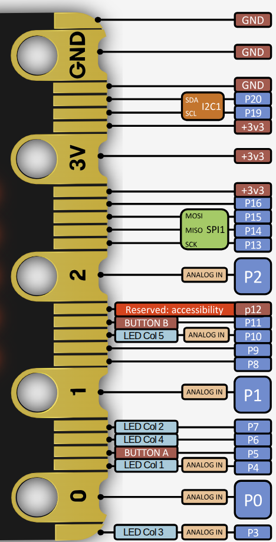

# Analog to Digital Converter (ADC) in nRF52833

The nRF52833 features a 12-bit Successive Approximation Register (SAR) ADC, referred to by Nordic as the SAADC, and supports up to 8 input channels for analog measurements.

Here is a mapping of analog input channels (AIN0 to AIN7) to their corresponding GPIO pins on the nRF52833.

| Analog Input | GPIO Pin |
| :----------: | :------: |
|     AIN0     |   P0.02  |
|     AIN1     |   P0.03  |
|     AIN2     |   P0.04  |
|     AIN3     |   P0.05  |
|     AIN4     |   P0.28  |
|     AIN5     |   P0.29  |
|     AIN6     |   P0.30  |
|     AIN7     |   P0.31  |

## Microbit Pin Layout

This table shows which analog input channels on the nRF52833 are accessible from the micro:bit v2 edge connector. The large pins (Ring 0, Ring 1 and Ring2) provide safe and direct access to analog input without conflict. The small pins (3, 4, 10) are also ADC-capable but are shared with the LED matrix, so they should only be used for analog input when the display is disabled.

| microbit Pin   | GPIO (nRF52833) | Analog Input | Accessible via | Shared With  | Notes                           |
| -------------- | --------------- | ------------ | -------------- | ------------ | ------------------------------- |
| 0              | P0.02           | AIN0         | Large ring     | —            | Fully available                 |
| 1              | P0.03           | AIN1         | Large ring     | —            | Fully available                 |
| 2              | P0.04           | AIN2         | Large ring     | —            | Fully available                 |
| 3              | P0.31           | AIN7         | Small pin 3    | LED Column 3 | Only usable when display is off |
| 4              | P0.28           | AIN4         | Small pin 4    | LED Column 1 | Only usable when display is off |
| 10             | P0.30           | AIN6         | Small pin 10   | LED Column 5 | Only usable when display is off |

## Reference
- [Edge Connector & micro:bit pinout](https://tech.microbit.org/hardware/edgeconnector/)
- [micro:bit pins](https://makecode.microbit.org/device/pins)
- [nR52833 Datasheet](https://docs.nordicsemi.com/bundle/ps_nrf52833/page/keyfeatures_html5.html)
- [Differential and Single-Ended ADC Paper](https://ww1.microchip.com/downloads/en/DeviceDoc/Differential-and-Single-Ended-ADC-WhitePaper-DS00003197A.pdf)
