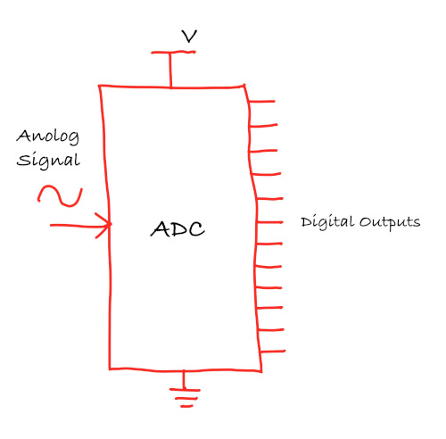

# ADC (Analog to Digital Converter)

An Analog-to-Digital Converter (ADC) is a device used to convert analog signals (continuous signals like sound, light, or temperature) into digital signals (discrete values, typically represented as 1s and 0s). This conversion is necessary for digital systems like microcontrollers (e.g., nrF52833, Raspberry Pi Pico) to interact with the real world. For example, sensors that measure temperature or sound produce analog signals, which need to be converted into digital format for processing by digital devices.

## ADC Resolution
The resolution of an ADC refers to how precisely the ADC can measure an analog signal. It is expressed in bits, and the higher the resolution, the more precise the measurements.

- 8-bit ADC produces digital values between 0 and 255.
- 10-bit ADC produces digital values between 0 and 1023.
- 12-bit ADC produces digital values between 0 and 4095.

The resolution of the ADC can be expressed as the following formula:
\\[
\text{Resolution} = \frac{\text{Vref}}{2^{\text{bits}} - 1}
\\]

## Microbit v2 (nRF52833)
The nRF52833 has 12-bit, 8 channel Analogue to Digital Converter (ADC). So, it provides values ranging from 0 to 4095 (4096 possible values)

\\[
\text{Resolution} = \frac{3.3V}{2^{12} - 1} = \frac{3.3V}{4095} \approx 0.000805 \text{V} \approx 0.8 \text{mV}
\\]

## ADC Value and LDR Resistance in a Voltage Divider
In a voltage divider with an LDR and a fixed resistor, the output voltage \\( V_{\text{out}} \\) is given by:

\\[
V_{\text{out}} = V_{\text{in}} \times \frac{R_{\text{LDR}}}{R_{\text{LDR}} + R_{\text{fixed}}}
\\]

It is same formula as explained in the previous chapter, just replaced the \\({R_2}\\) with \\({R_{\text{LDR}}}\\) and \\({R_1}\\) with \\({R_{\text{fixed}}}\\)

- **Bright light** (low LDR resistance): \\( V_{\text{out}} \\) decreases, resulting in a lower ADC value.
- **Dim light** (high LDR resistance): \\( V_{\text{out}} \\) increases, leading to a higher ADC value.

## Example ADC value calculation:

**Bright light**:

 Let's say the Resistence value of LDR is \\(1k\Omega\\) in the bright light (and we have \\(10k\Omega\\) fixed resistor).
  
\\[
V_{\text{out}} = 3.3V \times \frac{1k\Omega}{1k\Omega + 10k\Omega} \approx 0.3V
\\]

The ADC value is calculated as:
\\[
\text{ADC value} = \left( \frac{V_{\text{out}}}{V_{\text{ref}}} \right) \times (2^{12} - 1) \approx \left( \frac{0.3}{3.3} \right) \times 4095 \approx 372
\\]

**Darkness**:

  Let's say the Resistence value of LDR is \\(140k\Omega \\) in very low light.
  
\\[
V_{\text{out}} = 3.3V \times \frac{140k\Omega}{140k\Omega + 10k\Omega} \approx 3.08V
\\]

The ADC value is calculated as:
\\[
\text{ADC value} = \left( \frac{V_{\text{out}}}{V_{\text{ref}}} \right) \times (2^{12} - 1) \approx \left( \frac{3.08}{3.3} \right) \times 4095 = 3822
\\]

### **Converting ADC value back to voltage**:

Now, if we want to convert the ADC value back to the input voltage, we can multiply the ADC value by the resolution (0.8mV).

For example, let's take an ADC value of 3822:

\\[
\text{Voltage} = 3822 \times 0.8mV = 3057.6mV \approx 3.06V
\\]

## Single Ended vs Differential Mode

**Single-ended Mode**

In single-ended mode, the ADC measures the voltage on one signal pin with respect to ground. You can think of it like measuring how high a point is above the floor. This method is simple to use and requires only one input pin. However, it is more vulnerable to electrical noise, especially when using long wires, and it cannot measure negative voltages. 

This mode is commonly used in situations such as reading light levels using an LDR, measuring distances with infrared or ultrasonic sensors, and monitoring air or gas quality using analog sensor modules. The calculations we discussed earlier are all based on single-ended ADC measurements.

**Differential Mode**

In differential mode, the ADC measures the difference between two input pins, completely ignoring the ground. It is like comparing the height difference between two people, no matter where they are standing. 

This mode helps cancel out common noise seen on both inputs and is capable of detecting very small changes in voltage, including signals that swing both above and below ground. While it does require an additional pin and a slightly more complex setup, it is useful in high-precision applications such as measuring temperature using thermocouples or detecting pressure and force using strain gauges.

 
## Reference
- [What is Analog to Digital Converter & Its Working](https://www.elprocus.com/analog-to-digital-converter/)
- [Differential and Single-Ended ADC Paper](https://ww1.microchip.com/downloads/en/DeviceDoc/Differential-and-Single-Ended-ADC-WhitePaper-DS00003197A.pdf)
