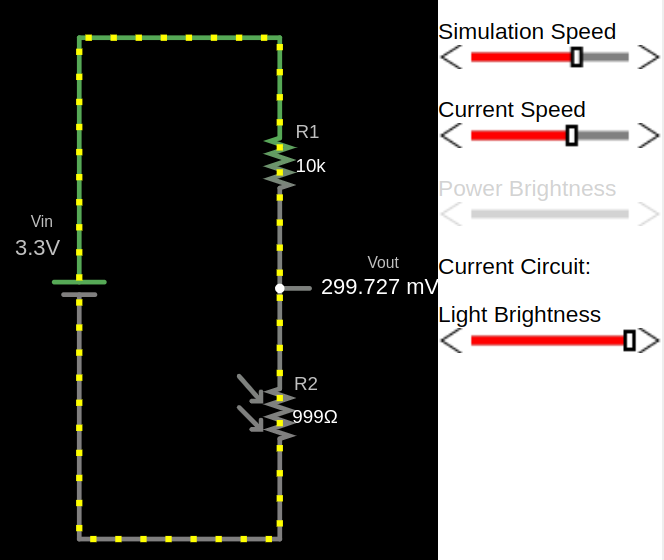
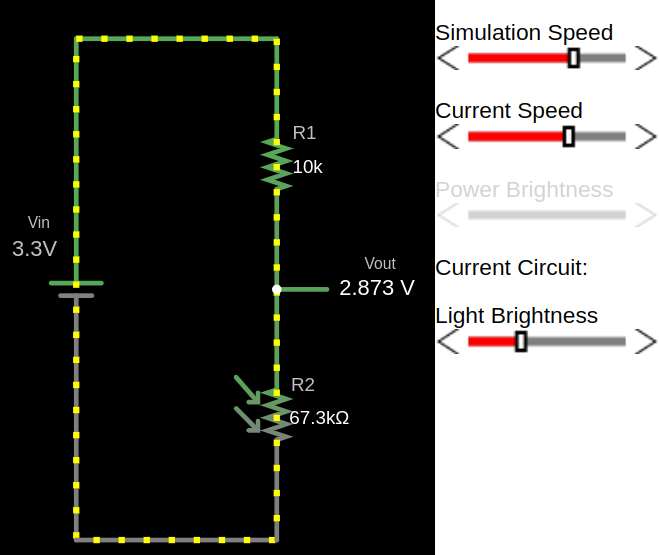
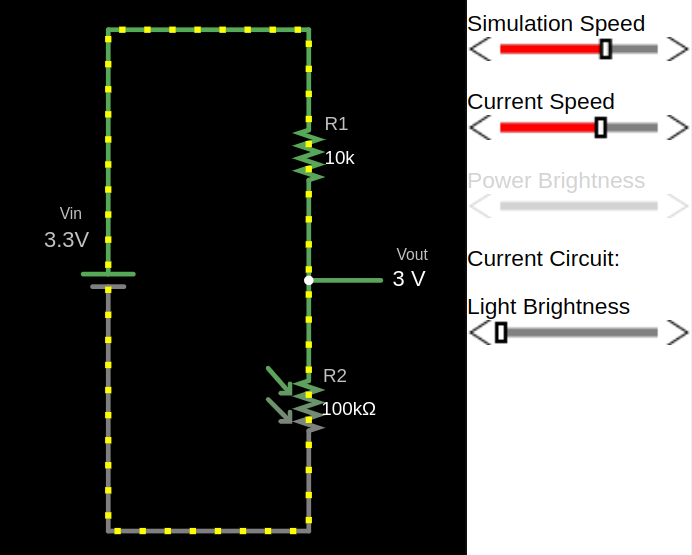

## How LDR works?

We have already given an introduction to what an LDR is. Let me repeat it again: an LDR changes its resistance based on the amount of light falling on it. The brighter the light, the lower the resistance, and the dimmer the light, the higher the resistance.

Dracula: Think of the LDR as Dracula. In sunlight, he gets weaker (just like the resistance gets lower). But in the dark, he gets stronger (just like the resistance gets higher).

We will not cover what kind of semiconductor materials are used to make an LDR, nor why it behaves this way in depth. I recommend you read this [article](https://www.elprocus.com/ldr-light-dependent-resistor-circuit-and-working/) and do further research if you are interested.

### Example output for full brightness
The resistance of the LDR is low when exposed to full brightness, causing the output voltage(\\( V_{out} \\)) to be significantly lower.

### Example output for low light
With less light, the resistance of the LDR increases and the output voltage increase.

### Example output for full darkness
In darkness, the LDR's resistance is high, resulting in a higher output voltage (\\( V_{out} \\)).

## Simulation of LDR in Voltage Divider
You can adjust the brightness value and observe how the resistance of R2 (which is the LDR) changes. Also, you can watch how the \\( V_{out} \\) voltage changes as you increase or decrease the brightness.

<label for="vin">Input Voltage (Vin):</label>
<input type="number" id="vin" step="0.01" value="3.3" oninput="updateAndCalculate()">  
<label for="r1">Resistor R1 (Ω):</label>
<input type="number" id="r1" step="1" value="10000" oninput="updateAndCalculate()">  
<label for="brightness">Brightness:</label>
<input type="range" id="brightness" min="0" max="100" value="50" oninput="updateAndCalculate()">
50%  

    Formula: \( V_\text{out} = V_\text{in} \times \frac{R_2}{R_1 + R_2} \)

    Filled Formula: Vout = 3.3 × 999 / (10000 + 999)

Output Voltage (Vout): 0.25 V

<canvas id="circuitCanvas" width="600" height="400"></canvas>

### Circuitjs 
The above diagrams are i created using the Falstad website. You can import the circuit file I created, [`voltage-divider-ldr.circuitjs.txt`](./voltage-divider-ldr.circuitjs.txt), import into the [Falstad site](https://www.falstad.com/circuit/) and play around.
 

