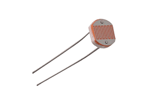

# LDR (Light Dependent Resistor)

We're now entering the next stage of our book, where we begin using external components. In this section, we'll start with an LDR (Light Dependent Resistor), also known as a photocell or photoresistor, and connect it to the Micro:bit.

An LDR changes its resistance based on the amount of light falling on it. The brighter the light, the lower the resistance, and the dimmer the light, the higher the resistance. This makes it ideal for applications like light sensing, automatic lighting, or monitoring ambient light levels.

## Components Needed:
- LDR (Light Dependent Resistor)
- Resistor (typically 10kΩ): needed to create voltage divider
- Alligator Clips: You can use either hybrid clips or double-ended alligator clips. In most cases, double-ended clips should be sufficient.

## Prerequisite

To work with this, you should get familiar with what a voltage divider is and how it works. You also need to understand what ADC is and how it functions. In this sections, we will introduce these concepts.
