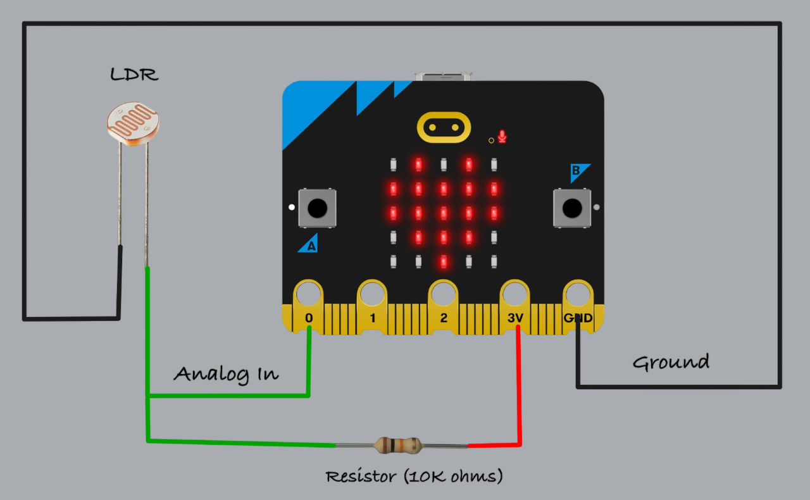
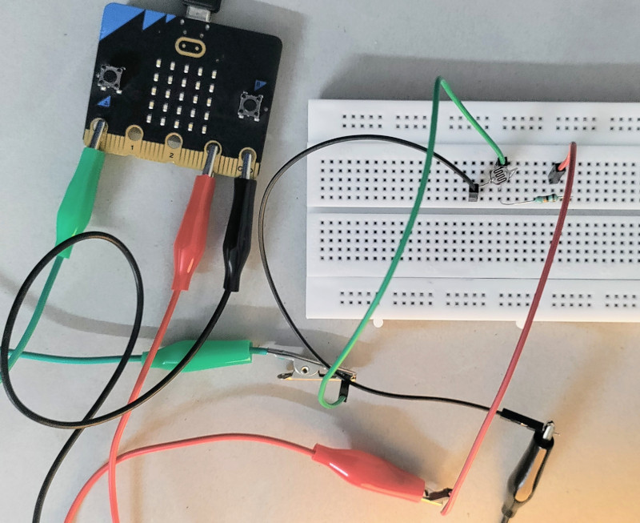
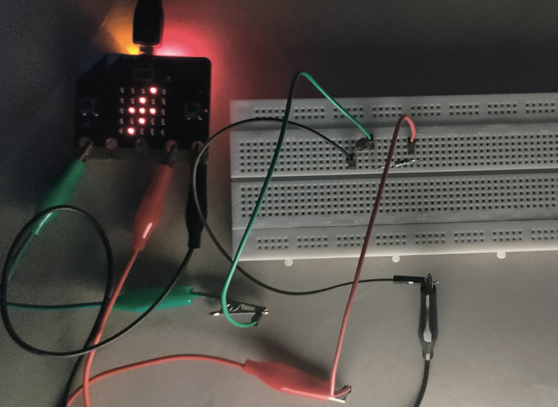

## Automatic LED Control Based on Ambient Light using an LDR and Microbit

In this exercise, we'll control an LED based on ambient light levels. The goal is to automatically turn on the LED in low light conditions. 

You can try this in a closed room by turning the room light on and off. When you turn off the room-light, the LED should turn on, given that the room is dark enough, and turn off again when the room-light is switched back on. Alternatively, you can adjust the sensitivity threshold or cover the light sensor (LDR) with your hand or some object to simulate different light levels.

Note: You may need to adjust the ADC threshold based on your room's lighting conditions and the specific LDR you are using.

## Circuit to connect LDR with Microbit

1. One side of the LDR is connected to Ground
2. The other side of the LDR is connected to Pin 0 (Analog In) on the Micro:bit. 
3. A 10K ohm resistor is connected between Pin 0 and 3V. 
4. This creates a voltage divider circuit, where the voltage at Pin 0 changes based on light levels. 

## Example Circuit

Here’s a photo of the circuit I built using an LDR, alligator clips, male-to-male jumper wires, and a breadboard.

**In the dark**

