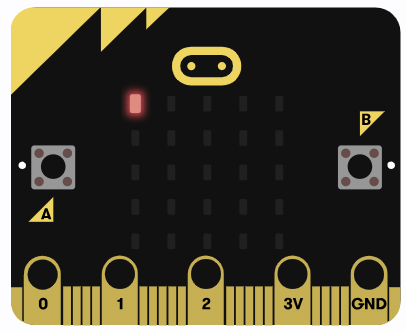

# Quick Start

Before diving into the theory and concepts of how everything works, let's jump straight into action. Use this simple code to create blink effect on the LED Matrix of the microbit.

The microbit has a 5x5 LED matrix that you can control to show patterns, characters, or animations. Each LED can be turned on or off to create different effects.

<a href ="./images/blinky.png"></a>


## The Full code

Don't worry about the code for now - we will explain it in the next chapter. This code simply turns on the LED at the top-left corner, then turns it off after a short delay to create a blinking effect.

```rust
#![no_std]
#![no_main]

use embedded_hal::{delay::DelayNs, digital::OutputPin};
use microbit::{board::Board, hal::timer::Timer};

use cortex_m_rt::entry;

#[panic_handler]
fn panic(_: &core::panic::PanicInfo) -> ! {
    loop {}
}

#[entry]
fn main() -> ! {
    let mut board = Board::take().unwrap();
    let mut timer = Timer::new(board.TIMER0);

    let _ = board.display_pins.col1.set_low();
    let mut row1 = board.display_pins.row1;

    loop {
        let _ = row1.set_low();
        timer.delay_ms(500);
        let _ = row1.set_high();
        timer.delay_ms(500);
    }
}

```

## Clone the Quick start project
You can clone the quick start project I created and navigate to the project folder and run it.

```sh
git clone https://github.com/ImplFerris/microbit-projects
cd microbit-projects/bsp/blinky
```

## Flash - `Run Rust Run`
All that's left is to flash the code onto our device and watch it go! 

Run the following command from your project folder:
```rust
cargo embed
```

The first LED in the top row of the display matrix should start blinking now.  If you are able to flash successfully and see the blinking effect, congratulations!
