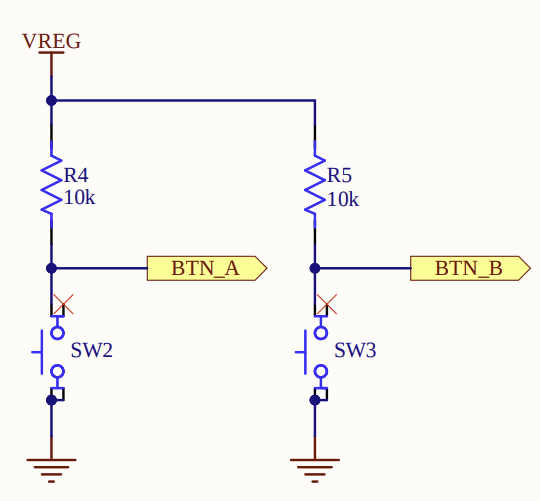

# Smiley Buttons

In this chapter, we will explore how to use the two onboard buttons of the micro:bit. The Smiley Buttons project is a great beginner-friendly exercise that introduces interactive input. By pressing the built-in buttons A and B, we will display different facial expressions on the micro:bit's LED screen.

- Press button A to show a happy face 😊

- Press button B to show a sad face 🙁

## Understanding Buttons

> 🪝 From the micro:bit documentation:  
>  
> Buttons operate in a typical inverted electrical mode, where a pull-up resistor ensures a logical ‘1’ when the button is released, and a logical ‘0’ when the button is pressed

This may sound a bit technical at first, so let us explain it more clearly.

When the button is not pressed, the micro:bit reads the input as a logical HIGH (i.e 1). This is due to the presence of a pull-up resistor, which maintains a high voltage level on the input pin.

When the button is pressed, the circuit is connected to ground, and the micro:bit reads a logical LOW (i.e 0).

<a href ="./images/microbit-buttons.png"></a>

Although pressing a button might intuitively seem like activating something, the hardware works in an inverted way. In code, we check for a LOW signal to detect when the button is pressed. Therefore, we will use the `is_low()` method on the button inputs to check whether it is being pressed.

## Create Project from template

To generate a new project using the template, run the following command:

```sh
cargo generate --git https://github.com/ImplFerris/mb2-template.git
```

When prompted for a project name, enter something like `smiley-buttons`

When it prompts to select "BSP" or "HAL", select the option "BSP".

## Matrix for emojis

Here is a 2D arrays representing the happy and sad faces.

```rust
let happy_face = [
        [0, 0, 0, 0, 0],
        [0, 1, 0, 1, 0],
        [0, 0, 0, 0, 0],
        [1, 0, 0, 0, 1],
        [0, 1, 1, 1, 0],
    ];

    let sad_face = [
        [0, 0, 0, 0, 0],
        [0, 1, 0, 1, 0],
        [0, 0, 0, 0, 0],
        [0, 1, 1, 1, 0],
        [1, 0, 0, 0, 1],
    ];
```

## Initialization

As usual, we begin by initializing the board, followed by the display and the timer. We also access button_a and button_b from the board and store them in variables for convenience.

```rust
    let board = Board::take().unwrap();

    let mut display = Display::new(board.display_pins);
    let mut timer = Timer::new(board.TIMER0);

    let mut button_a = board.buttons.button_a;
    let mut button_b = board.buttons.button_b;
```

## Button Input and Showing Smiley

Now that the buttons and display are initialized, we can write a loop that reacts to button input and shows the appropriate facial expression on the LED screen.

```rust
    loop {
        let a_pressed = button_a.is_low().unwrap_or(false);
        let b_pressed = button_b.is_low().unwrap_or(false);

        if a_pressed {
            display.show(&mut timer, happy_face, 1000);
            timer.delay_ms(100);
        } else if b_pressed {
            display.show(&mut timer, sad_face, 1000);
            timer.delay_ms(100);
        }
    }
```

In this loop, we check the state of each button using the `.is_low()` method. Since the buttons on the micro:bit are active-low, this method returns true when the button is pressed. We use .unwrap_or(false) to handle any potential errors. If the result cannot be read for any reason, it will simply return false, treating the button as unpressed.

When button A is pressed, the happy face pattern is shown on the LED display for one second. Similarly, if button B is pressed, the sad face is displayed. 

A short delay of 100 milliseconds follows each display to give a clear visual effect and to avoid repeated updates caused by the button being held down. 

## The Full code

This exercise includes a new import not present in the previous one: `embedded_hal::digital::InputPin`. This trait is part of the Embedded HAL and provides methods such as `is_low()` and `is_high()` for reading the state of input pins.

```rust
#![no_std]
#![no_main]

use cortex_m_rt::entry;
use embedded_hal::{delay::DelayNs, digital::InputPin};
use microbit::{display::blocking::Display, hal::Timer, Board};

#[panic_handler]
fn panic(_: &core::panic::PanicInfo) -> ! {
    loop {}
}

#[entry]
fn main() -> ! {
    let board = Board::take().unwrap();

    let mut display = Display::new(board.display_pins);
    let mut timer = Timer::new(board.TIMER0);

    let mut button_a = board.buttons.button_a;
    let mut button_b = board.buttons.button_b;

    let happy_face = [
        [0, 0, 0, 0, 0],
        [0, 1, 0, 1, 0],
        [0, 0, 0, 0, 0],
        [1, 0, 0, 0, 1],
        [0, 1, 1, 1, 0],
    ];

    let sad_face = [
        [0, 0, 0, 0, 0],
        [0, 1, 0, 1, 0],
        [0, 0, 0, 0, 0],
        [0, 1, 1, 1, 0],
        [1, 0, 0, 0, 1],
    ];

    loop {
        let a_pressed = button_a.is_low().unwrap_or(false);
        let b_pressed = button_b.is_low().unwrap_or(false);

        if a_pressed {
            display.show(&mut timer, happy_face, 1000);
            timer.delay_ms(100);
        } else if b_pressed {
            display.show(&mut timer, sad_face, 1000);
            timer.delay_ms(100);
        }
    }
}
```


## Clone the existing project
You can also clone (or refer) project I created and navigate to the `bsp/smiley-buttons` folder.

```sh
git clone https://github.com/ImplFerris/microbit-projects
cd microbit-projects/bsp/smiley-buttons
```


## Flash

With the code complete, you can now flash the program to the micro:bit using the following command:

```sh
cargo flash
```
Once the program is running on the device, pressing `button A` will display the happy face, and pressing `button B` will show the sad face on the LED display.
