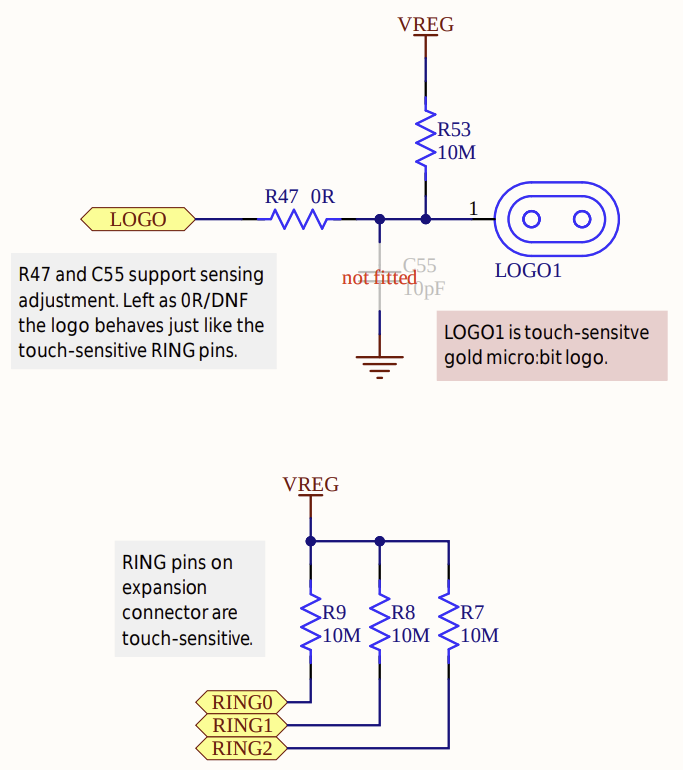

# Touch Sensing

The micro:bit V2 has built-in support for basic touch sensing. It allows you to detect when someone touches certain pins or the gold logo on the front of the board. Unlike a mechanical button, this feature works by detecting small changes in electrical charge when your finger comes close to the pin. This enables you to build interactive projects where a simple touch can trigger actions, just like tapping on a touchscreen.

Touch sensing on the micro:bit is possible because of special circuitry and software that detect changes in voltage when your body comes in contact with the pin.


## How Touch Sensing Works
The micro:bit V2 uses capacitive touch sensing on specific GPIO pins (P0, P1, P2) and the logo (which is connected to the P1_04 GPIO pin, as shown in the [micro:bit v2 pinmap](https://tech.microbit.org/hardware/schematic/#v2-pinmap)). This is different from regular digital input, which typically involves pressing a mechanical switch.

Capacitive sensing relies on detecting changes in capacitance. Your body is a conductor and forms a capacitor with the micro:bit pin when you touch or come near it. The board monitors how long it takes for a pin to charge or discharge electrically, and when your finger is present, this time changes because of the additional capacitance from your body.

### Weak Pull-Up Resistor

Touch sensing mode uses an internal weak pull-up resistor, typically 10 MΩ, connected to the GPIO pin. This resistor pulls the pin up to the supply voltage (~3.0V), keeping the input in a logical HIGH state when not touched.

<a href ="./images/touch-sensing.png"></a>


When you touch the pin (or the logo), your finger acts as a conductor and introduces a path to ground (through your body and the environment), slightly discharging the pin. This results in a detectable voltage drop that is read as a logical LOW.

## Pin Configuration

When using touch sensing, you should configure the pin as a floating input. This mode allows the voltage on the pin to be affected by small currents (like those introduced by a human touch) because nothing else is driving the pin.

```rust
let mut touch_input = board.pins.p1_04.into_floating_input();
```
This disables the default pull-down resistor and allows the external capacitance to influence the pin voltage.

## Detecting the Touch in Code
Once the pin is configured, you can use the is_low() to check the current voltage level:

```rust
if touch_input.is_low().unwrap() {
    // Pin is being touched
}
```

