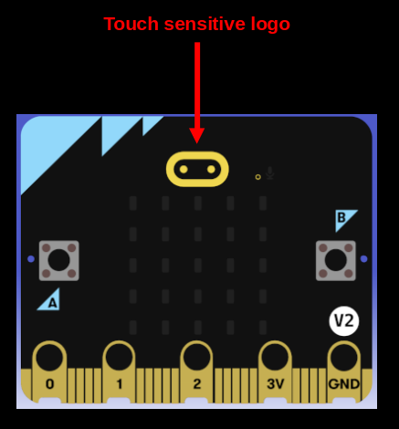

# Simple Touch

Let's write a simple program that displays a character or emoji on the LED matrix when the micro:bit logo is touched. In this example, we will show a voltage emoji symbol (⚡) whenever the logo is touched.


<a href ="./images/microbit-logo.png"></a>


## Create Project from template

To generate a new project using the template, run the following command:

```sh
cargo generate --git https://github.com/ImplFerris/mb2-template.git --rev 88d339b
```

When prompted for a project name, enter something like `smiley-buttons`

When it prompts to select "BSP" or "HAL", select the option "BSP".

## Initialize Board, Timer, and Display

Start by setting up the board, timer, and display as usual:
```rust
let board = Board::take().unwrap();
let mut timer = Timer::new(board.TIMER0);
let mut display = Display::new(board.display_pins);
```

## LED Matrix for Voltage Symbol

```rust
let led_matrix = [
    [0, 0, 0, 1, 0],
    [0, 0, 1, 0, 0],
    [0, 1, 1, 1, 0],
    [0, 0, 1, 0, 0],
    [0, 1, 0, 0, 0],
];
```

## Configure the Logo Pin as Touch Input

Set the GPIO pin p1_04 (which is internally connected to the small micro:bit logo) as a floating input. This allows it to detect touch using capacitive sensing.

When the logo is touched, the micro:bit will show a voltage symbol on the LED matrix for 500 milliseconds, then clear the display.

```rust
// Pin connected to the Logo
let mut touch_input = board.pins.p1_04.into_floating_input();

loop {
    if touch_input.is_low().unwrap() {
        display.show(&mut timer, led_matrix, 500);
    } else {
        display.clear();
    }
}
```

## The Full Code

```rust
#![no_std]
#![no_main]

use embedded_hal::digital::InputPin;
use microbit::{board::Board, display::blocking::Display, hal::timer::Timer};

use cortex_m_rt::entry;

#[panic_handler]
fn panic(_: &core::panic::PanicInfo) -> ! {
    loop {}
}

#[entry]
fn main() -> ! {
    let board = Board::take().unwrap();
    let mut timer = Timer::new(board.TIMER0);
    let mut display = Display::new(board.display_pins);
    let led_matrix = [
        [0, 0, 0, 1, 0],
        [0, 0, 1, 0, 0],
        [0, 1, 1, 1, 0],
        [0, 0, 1, 0, 0],
        [0, 1, 0, 0, 0],
    ];

    // Pin connected to the Logo
    let mut touch_input = board.pins.p1_04.into_floating_input();

    loop {
        if touch_input.is_low().unwrap() {
            display.show(&mut timer, led_matrix, 500);
        } else {
            display.clear();
        }
    }
}
```

## Clone the existing project
You can also clone (or refer) project I created and navigate to the `bsp/logo-touch` folder.

```sh
git clone https://github.com/ImplFerris/microbit-projects
cd microbit-projects/bsp/logo-touch
```

## Flash

With the code complete, you can now flash the program to the micro:bit using the following command:

```sh
cargo flash
```
